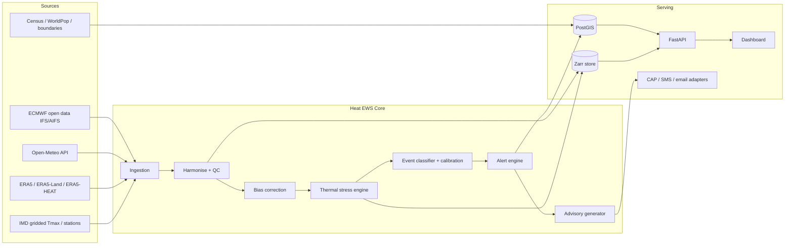
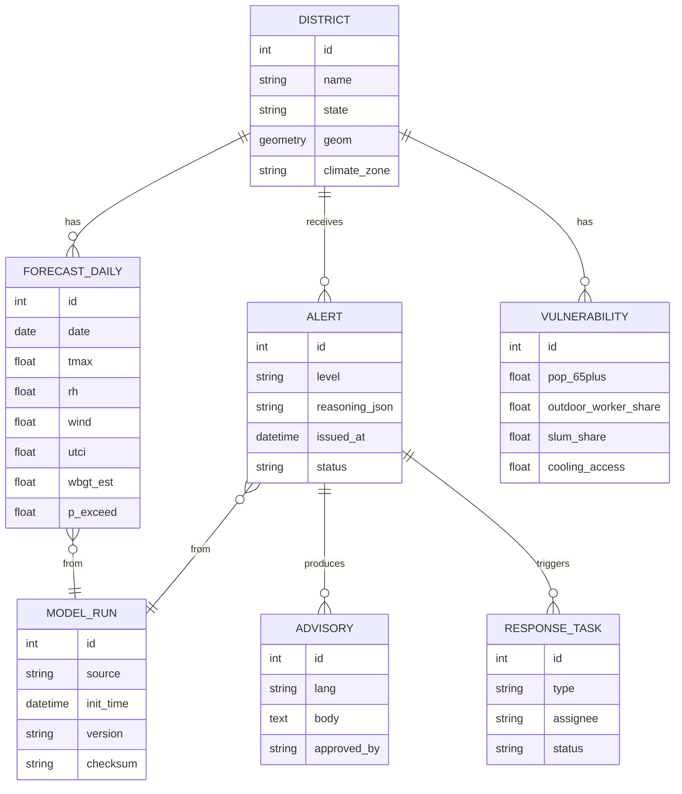
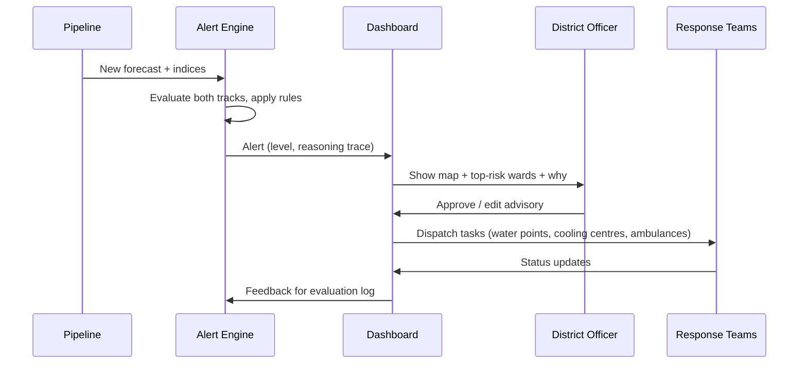

# ARCHITECTURE.md

> **Design-phase document.** It records the original plan. For the system as built — 641 districts, ERA5 normals, replays, bias correction, dashboard and API — see [`PROJECT_OVERVIEW.md`](PROJECT_OVERVIEW.md).

## Assumptions (attack these)

1. Prototype scale: India-wide at **district** level; 1–2 pilot cities at finer grid.
2. The system **consumes** an open forecast; it does not produce a new global forecast.
3. The alert decision path is **deterministic + calibrated ML**, auditable. LLMs never decide alert levels.
4. Free/open data only.
5. Composite index weights are **assumptions**, exposed as config, not validated science.

## System context



## Layered design

| Layer | Responsibility | Key rule |
|-------|----------------|----------|
| L1 Ingestion | Fetch forecasts + history, retry, checksum, store raw immutably | Never mutate raw data. Every downstream artefact records the raw run ID it came from. |
| L2 Harmonise/QC | Common grid, units, time zone (store UTC, display IST), range and gap checks | A failed QC **blocks alerting** rather than emitting on bad data. |
| L3 Bias correction | Per-climate-zone residual model (forecast vs ERA5/obs) for T, RH, wind | Humidity correction is the priority (see RESEARCH_MATRIX A7). |
| L4 Thermal stress engine | UTCI (primary), estimated WBGT (secondary), Heat Index; nighttime recovery; duration | Pure functions, unit-tested against published reference values. |
| L5 Event classifier | Probability of threshold exceedance per district per lead day | Calibrated. Reliability diagram is a shipped artefact. |
| L6 Alert engine | Maps probability + severity + duration + vulnerability to IMD-style colour levels | Fully deterministic, rules in versioned YAML, every alert stores its reasoning trace. |
| L7 Advisory generator | Turns structured alerts into localised text | Template-first; LLM only fills templates; human approval gate before dispatch. |

## Alert decision logic (design, not validated)

An alert level is the **max** of two independent tracks, so neither can silently mask the other:

- **Track 1: IMD-criteria track.** Reproduce IMD's published criteria (40/37/30°C thresholds, departure 4.5–6.4°C, severe >6.4°C or ≥45/47°C absolute). This keeps the system legible to officials.
- **Track 2: Human-stress track.** UTCI category, estimated WBGT, consecutive-hot-night count, and calibrated exceedance probability.

Rationale: the literature shows temperature-only alerts miss humid-heat danger (RESEARCH_MATRIX A9, C2). Track 2 exists to catch cases where air temperature looks unremarkable but body strain is severe. **Where the two tracks disagree, log it — those disagreements are your most interesting evaluation data.**

Lag-awareness: mortality effects lag heat by roughly 3–6 days in the cited Indian cities (C2). So the alert engine considers **cumulative exposure over the trailing days**, not only the forecast day.

## Composite Human Thermal Stress Index (HTSI) — proposed

```
HTSI_district_day = w1 * S_utci  +  w2 * S_wbgt_est  +  w3 * S_night  +  w4 * S_duration
RISK = HTSI * (1 + w5 * Vulnerability_district)
```
- All S_* normalised 0–1 from category thresholds.
- Default weights live in `config/htsi_weights.yaml`.
- **Status: proposed, unvalidated.** Ship a sensitivity analysis showing how ranking of districts changes as weights vary. That is more defensible than defending one set of numbers.

## Data model (core tables)



## Decision-support workflow (civic authority)



Roles: `viewer`, `district_officer`, `state_admin`. Advisory dispatch requires `district_officer` approval. Log every action.

## Failure modes and mitigations

| Failure | Consequence | Mitigation |
|---------|-------------|------------|
| Upstream forecast late/missing | Stale alerts | Show data age on every panel; degrade to last-good with a visible warning banner; never present stale data as current. |
| AI-forecast humidity low bias | Under-warning for humid heat | Bias correction + report humid-heat skill separately; document limit. |
| False alarms | Alert fatigue | Track precision/recall per level; require calibration; tune thresholds on held-out years. |
| Missed events | Harm | Prefer recall at lower alert levels; escalate on Track 2 disagreement. |
| Stale census vulnerability | Misprioritisation | Label data vintage on the UI. |
| Boundary/licence non-compliance | Legal/credibility | Use government-sanctioned boundaries; record source and licence. |
| LLM advisory error | Wrong public guidance | Template-first, human approval, never auto-send. |

## Non-goals

- Replacing IMD's official warnings. This is a decision-support prototype layered on open data.
- Health-outcome prediction. Mortality is used to motivate design, not as a modelled target, because no clean open outcome dataset is assumed.
- Real telecom delivery.

## What would change my mind on this design

- If ERA5-vs-forecast residual analysis shows the AI/IFS humidity bias is small over India for your validation years, drop the dedicated humidity correction to a simple linear fix.
- If a sequence model beats the GBM baseline on **leave-one-year-out** extreme-event skill by a clear margin, promote it; otherwise keep the simpler model.
- If IMD's revised criteria (reported in May 2026) differ materially, Track 1 rules change; they live in YAML for this reason.
