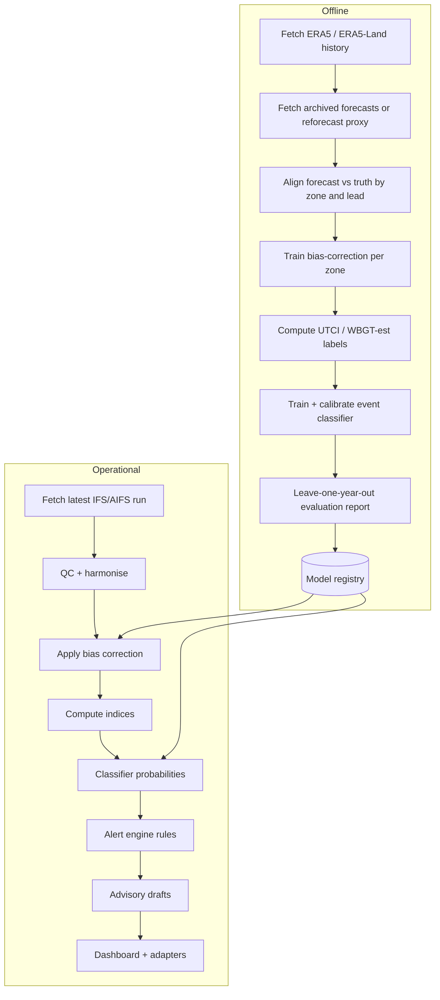

# PIPELINE.md

## Overview

Two pipelines share code but run on different schedules.

1. **Training/offline pipeline:** builds bias-correction and classifier models from history. Run rarely.
2. **Operational pipeline:** runs each forecast cycle, produces indices, probabilities, alerts.

## Stage contracts

Every stage has an input contract, output contract, tests and a failure behaviour. Agentic coders should implement one stage at a time against these.

| Stage | Input | Output | Tests | On failure |
|-------|-------|--------|-------|------------|
| S1 Fetch | source config, run time | raw files + manifest (checksum, run id) | mocked HTTP; retry/backoff; idempotency | Retry, then mark run `failed`; do not proceed |
| S2 QC/harmonise | raw | zarr on common grid, UTC | range checks (T, RH 0–100, wind ≥ 0); gap detection; unit tests on conversion | Block alerting; raise banner |
| S3 Bias correct | zarr + model | corrected zarr | corrected error ≤ raw error on held-out set | Fall back to raw with a flag `bias_corrected=false` |
| S4 Indices | corrected T, RH, wind, radiation | UTCI, WBGT-est, HI per cell | **reference-value tests** against published table values; monotonicity checks (higher RH at fixed T must not lower heat stress) | Fail loudly. Never emit an index that fails a sanity test |
| S5 Aggregate | cell indices + district polygons | district-day table | zonal-stat correctness on synthetic rasters | Block |
| S6 Classify | district features | calibrated probabilities | calibration slope/intercept on holdout; reliability diagram | Use rule-only track and flag |
| S7 Alert engine | probabilities, indices, vulnerability | alerts + reasoning JSON | table-driven rule tests, incl. tracks disagreeing | Default to the **higher** of tracks; log |
| S8 Advisory | alert | localized drafts pending approval | template lint; language checks | Ship template text without LLM fill |
| S9 Publish | alerts, drafts | DB rows, CAP files, dashboard | schema validation of CAP output | Retry; alert admin |

## Feature engineering (classifier)

- Lagged Tmax / UTCI (t-1 … t-6), reflecting lagged mortality effects (RESEARCH_MATRIX C2).
- Consecutive days above threshold; consecutive hot nights.
- Departure from 1991–2020 climatology (IMD uses 1991–2020 normals per press coverage; **verify**).
- Day-of-year (cyclical encoding), climate zone, elevation, urban fraction.
- Soil moisture / recent rainfall if available. (Note irrigation is argued to raise moist heat in India; see C-series discussion.)

## Evaluation protocol (non-negotiable)

1. **Split by year, not by row.** Leave-one-heatwave-year-out (e.g. hold out 2010, 2015, 2019, 2022, 2024 in turn).
2. Report per climate zone, not only pooled.
3. Metrics: **POD (recall), FAR, CSI/threat score, Brier score, reliability diagram.** Accuracy is meaningless under class imbalance.
4. Compare against baselines: **(a) persistence, (b) raw forecast + IMD thresholds, (c) climatology.** If you cannot beat (b), say so. That is a legitimate finding.
5. Report humid-heat events (e.g. April 2023) as a separate case study, since the literature flags this as where AI forecasts struggle (A9).
6. Publish the confusion matrix by lead day (1–7).

## Data volume / performance notes

- India at 0.25°: order of thousands of cells per field; daily aggregation is light. Do not over-engineer.
- ERA5 CDS requests queue; start prefetch on day 1.
- Cache zonal-stat weights (cell→district) once.

## Scheduling

- Operational: every 6 h to match IFS open data cycles [JUDGMENT: confirm the run/dissemination schedule on ECMWF's page; ECMWF notes a ~2 h open-data delay per the Open-Meteo docs].
- Use idempotent runs keyed by `source + init_time`.

## Reproducibility

- Pin all package versions (`uv.lock` or `requirements.lock`).
- Every model artefact stores: code git SHA, data run IDs, config hash.
- Every alert stores: model versions, rule file version, reasoning trace.

## Data quality gates (automated)

Use Pandera/Great Expectations for: value ranges, no-NaN in required fields, monotone time axis, grid shape match, freshness (fail if source older than N hours).
