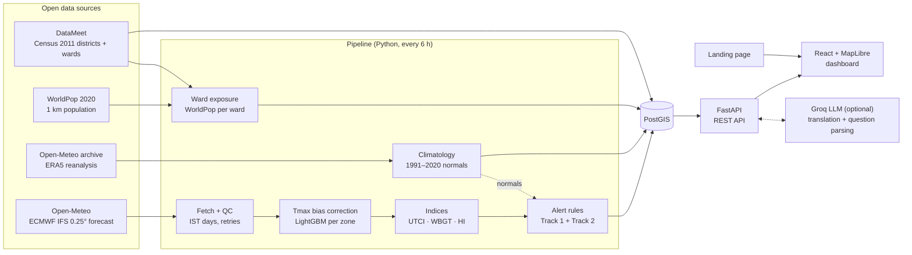
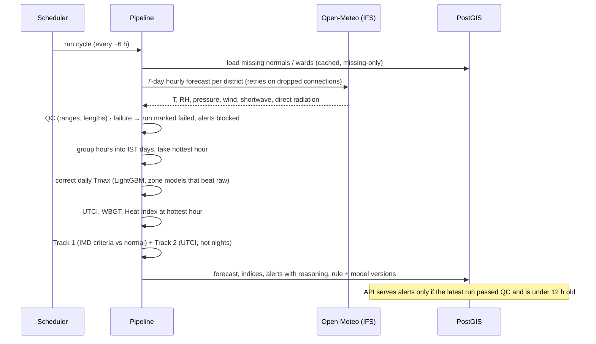
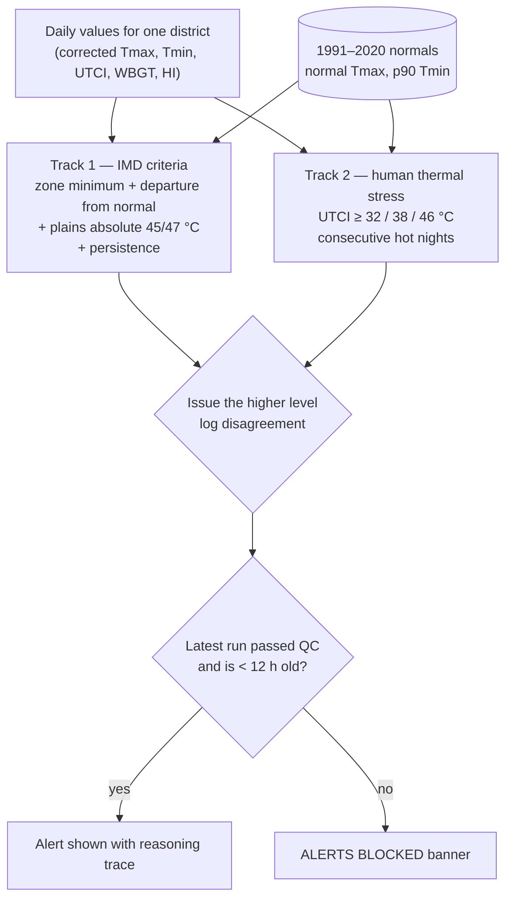
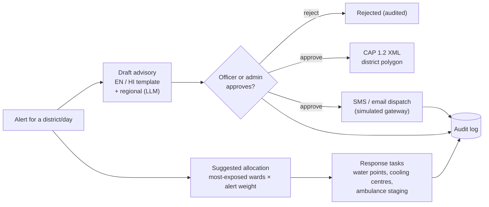

# Heatwatch India — Project Overview

**Extreme heatwave early warning and human thermal stress index for India**

Prototype built for the Ministry of Earth Sciences (MoES) problem statement *Extreme Heatwave Early Warning and Human Thermal Stress Index* (Disaster Management theme). This document explains what the system does, why it is built the way it is, and how every part works. It describes the system as built; the design documents in `docs/` (PRD, ARCHITECTURE, PIPELINE, TECH_STACK) record the original plan.

> Not an official IMD warning. Heatwatch is a decision-support prototype and is not affiliated with or endorsed by MoES or IMD.

---

## 1. At a glance

Heatwatch turns an open 7-day weather forecast into heat warnings that reflect what the human body feels, and gives district officers the tools to act on them: advisories in local languages, officer approval, CAP export, and resource allocation to the most exposed wards.

| Fact | Value |
|---|---|
| Districts monitored | All 641 Census 2011 districts, every state and union territory |
| Thermal stress indices | 3 — UTCI, estimated WBGT, Heat Index |
| Forecast | ECMWF IFS 0.25° via Open-Meteo, 7 days, hourly, refreshed every 6 hours |
| Climate normals | 1991–2020 daily normals per district (Copernicus ERA5, adjusted to each forecast point's elevation) |
| Alert tracks | 2 — IMD heat-wave criteria and human thermal stress; the higher is issued |
| Staleness gate | Alerts are blocked if forecast data are older than 12 hours or fail quality checks |
| Ward-level exposure | 539 wards in Ahmedabad (48), New Delhi/NCT (290) and Chennai (201) |
| Historical replays | 4 real heatwaves (2015, 2019, 2024 ×2) run through the live code |
| Machine learning | LightGBM Tmax bias correction per climate zone, leave-one-year-out evaluated |
| Languages | English and Hindi templates; Gujarati, Tamil, Telugu, Marathi, Bengali, Odia via LLM translation |
| Automated tests | 76 backend tests (unit and PostGIS integration) |

---

## 2. The problem

India's heatwaves are becoming more frequent and intense. Official heat-wave declarations are based on air temperature: how hot it is, and how far above normal. But the danger to people depends on more than air temperature. Humid air slows sweat evaporation, sunshine adds radiant heat, and still air removes less heat from the skin. A humid coastal day at 38 °C can stress the body more than a dry inland day at 42 °C.

The problem statement asks for four things:

1. **Data ingestion** — temperature, humidity, wind and solar radiation from open weather APIs or historical datasets.
2. **Thermal stress indexing** — standard bioclimatic indices such as WBGT, Heat Index or UTCI.
3. **Early warning** — predictive AI/ML mapping or forecasting that issues alerts or maps of zones prone to critical heat exposure.
4. **Decision support** — an interactive GIS platform for civic authorities to orchestrate response workflows, resource allocation and advisory dispatch.

## 3. What we built, mapped to the requirements

| Requirement | How Heatwatch meets it | Where |
|---|---|---|
| Data ingestion | Hourly temperature, relative humidity, surface pressure, 10 m wind, shortwave and direct radiation from the ECMWF IFS forecast; 30 years of ERA5 daily Tmax/Tmin for normals; ERA5 hourly history for replays | `backend/pipeline/s1_fetch.py`, `climatology.py`, `replay.py` |
| Thermal stress indices | UTCI, estimated WBGT (Liljegren) and Heat Index computed at the hottest hour of each IST day | `backend/indices/` |
| Early warning + AI/ML | Two alert tracks (IMD criteria against 1991–2020 normals; UTCI human-stress scale with hot nights), max-of-tracks, full reasoning trace; LightGBM bias correction of forecast Tmax; historical replays of real heatwaves | `backend/app/alerts.py`, `backend/pipeline/operational.py`, `backend/models/` |
| Decision-support GIS | MapLibre dashboard: alert and index layers, 7-day selector, district ranking, ward exposure map, advisories with officer approval, CAP 1.2, simulated SMS/email dispatch, ward resource allocation, task board, audit log, question box | `frontend/src/`, `backend/app/main.py` |

---

## 4. Architecture




### Components

| Component | Technology | Role |
|---|---|---|
| Pipeline | Python 3.13, pythermalcomfort 4.6.0, thermofeel 2.3.0, LightGBM, rioxarray | Fetches data, runs QC, computes indices and alerts, loads normals and ward exposure |
| Database | PostgreSQL 17 + PostGIS 3.5 | Districts, forecasts, indices, alerts, normals, wards, advisories, tasks, audit log |
| API | FastAPI | 25 endpoints for the dashboard and integrations (section 12) |
| Dashboard | React 19, TypeScript, Vite, MapLibre GL | Map, charts, operations workflow |
| Landing page | Static HTML (Tailwind CDN) | Project introduction, links into dashboard and replays |
| LLM (optional) | Groq, `llama-3.3-70b-versatile` | Translates approved advisories; parses dashboard questions |

### Deployment (Docker Compose)

| Service | What it runs |
|---|---|
| `postgres` | PostGIS database |
| `backend` | FastAPI on port 8000 |
| `pipeline` | One pipeline cycle at start-up |
| `scheduler` | Repeats the pipeline about every 6 hours |
| `frontend` | Dashboard and landing page on port 5173 |

---

## 5. One forecast cycle, step by step




Key behaviours:

- **Idempotent and traceable.** Each run has an ID (`open-meteo-YYYYMMDDTHHMMSSZ`). Raw responses and a SHA-256 manifest are stored under `data/raw/open-meteo/<run_id>/`.
- **Local days.** Hourly values are grouped by IST calendar day; each day's indices use the hottest hour.
- **Fail safe.** Any fetch or QC failure writes a failed run. The dashboard then shows *ALERTS BLOCKED* rather than stale levels.
- **Retries.** Dropped connections, rate limits (HTTP 429) and server errors are retried with back-off; other errors fail the run.

---

## 6. Data sources

| Source | Used for | Licence |
|---|---|---|
| Open-Meteo forecast API, model `ecmwf_ifs025` | Live 7-day hourly forecast | Open-Meteo terms (non-commercial free tier); ECMWF open data CC BY 4.0 |
| Copernicus Climate Data Store, ERA5 hourly 2 m temperature and orography | 1991–2020 normals for all districts | CC BY 4.0 |
| Open-Meteo historical archive (ERA5) | Historical replays, bias-correction target | CC BY 4.0 (Copernicus ERA5) |
| Open-Meteo elevation API (Copernicus 90 m DEM) | Terrain for the climate-zone rule | Copernicus DEM licence |
| Natural Earth 10 m coastline | Coastal-zone rule | Public domain |
| Open-Meteo historical forecast API (IFS) | 2024–2025 forecast history for training | As above |
| WorldPop 2020 India 1 km population | Ward population exposure | CC BY 4.0 |
| DataMeet Census 2011 district boundaries | District polygons | CC BY 2.5 India |
| DataMeet municipal ward boundaries | Ahmedabad, Delhi, Chennai wards | CC BY-SA 2.5 India |

All sources are pinned in config (`config/boundary_source.json`, `config/vulnerability_source.json`) with commit hashes or checksums. Expensive-to-rebuild results are committed to the repository: `data/climatology/normals_era5.json` (1991–2020 normals for all 641 districts), `data/raw/bias_training/`, `data/replay/` and `data/models/`. The 2.7 GB of raw ERA5 hourly files are not committed; `python -m pipeline.climatology cds` rebuilds them with a Copernicus key.

### Coverage

All 641 Census 2011 districts: 465 plains, 92 coastal, 84 hills (the zone decides which IMD criteria apply).

| How it was set | Districts |
|---|---|
| Hand-chosen forecast point (city) and zone | 81 heat-prone and demo districts |
| Automatic forecast point (guaranteed inside the district) and rule-based zone | 560 |

The zone rule (`scripts/build_all_districts.py`): **hills** if the median of 7 sampled elevations is at least 1000 m, or at least 400 m with 800 m of relief (this separates hill districts like Idukki from flat plateaus like Bengaluru); **coastal** if the district is within 25 km of the coastline; otherwise **plains**.

---

## 7. Thermal stress indices

| Index | What it measures | Implementation | Inputs | Notes |
|---|---|---|---|---|
| **UTCI** — Universal Thermal Climate Index | "Feels-like" temperature from a model of human heat balance | `pythermalcomfort.utci` (v4.6.0) | Air temperature, mean radiant temperature, wind, humidity | Shade estimate: mean radiant temperature is set to air temperature because the forecast lacks the full radiation budget. Primary index. |
| **WBGT (estimated)** — Wet Bulb Globe Temperature | Heat stress for work and exercise; used by occupational and sports guidelines | `thermofeel.calculate_wbgt_liljegren` (v2.3.0) | Temperature, humidity, pressure, wind, shortwave radiation, direct fraction, solar zenith (NOAA equations) | Estimated, not measured: real WBGT needs a globe thermometer. |
| **Heat Index** | Apparent temperature from temperature and humidity (NOAA) | `pythermalcomfort.heat_index_rothfusz` | Temperature, humidity | Undefined below 27 °C (stored as null). |

Each index has reference-value and monotonicity tests (raising humidity at fixed temperature must not reduce heat stress) in `backend/tests/`.

---

## 8. Alert logic




### Track 1 — IMD heat-wave criteria

Rules are versioned in `config/alert_rules.yaml` (version `heatwatch-rules-2026-10-01`), taken from IMD's heat-wave criteria.

| Rule | Value |
|---|---|
| Zone minimum Tmax before any heat wave | Plains 40 °C, coastal 37 °C, hills 30 °C |
| Heat wave | Departure from normal ≥ 4.5 °C |
| Severe heat wave | Departure > 6.4 °C |
| Plains absolute rule | ≥ 45 °C heat wave, ≥ 47 °C severe |
| Colours from persistence | Yellow: 2 consecutive heat-wave days. Orange: 4 heat-wave days or 2 severe. Red: 3 severe days or more than 6 hot days. |

The normal for a day is the mean daily Tmax within ±7 days across 1991–2020. Daily Tmax and Tmin come from hourly ERA5 at the hottest and coolest hours of the IST day (the same definition the forecast uses), interpolated to the forecast point and adjusted to its elevation with the standard 6.5 °C/km lapse rate. Persistence looks ahead through the forecast (early warning); a hot day also keeps the hot spell it belongs to, so the last days of a spell are not reset to green.

### Track 2 — human thermal stress

| Rule | Value |
|---|---|
| UTCI (UTCI assessment scale) | ≥ 32 °C yellow (strong stress), ≥ 38 °C orange (very strong), ≥ 46 °C red (extreme) |
| Hot nights | Consecutive days with Tmin ≥ both the 1991–2020 90th-percentile Tmin and 25 °C: 2 → yellow, 3 → orange |
| Estimated WBGT | Shown in the reasoning; does not escalate on its own |

Track 2 thresholds are labelled `unvalidated_assumption` in config. They follow the published UTCI scale but have not been calibrated against Indian health outcomes.

### Combining and safety

- The issued level is the **higher** of the two tracks. Disagreement is recorded.
- Every alert stores its reasoning trace, rule version, forecast model and run ID.
- No LLM is involved in choosing a level.

### Worked example (real data)

Bhubaneswar, 28 May 2024, from the ERA5 replay:

| Measure | Value |
|---|---|
| Maximum temperature | 37.9 °C, +1.4 °C above the 1991–2020 normal |
| Track 1 (IMD criteria) | **Green** — well short of a heat wave |
| Relative humidity at the hottest hour | 58% |
| Estimated WBGT | 35.5 °C |
| UTCI | 40.5 °C (very strong heat stress) |
| Heat Index | 53.2 °C |
| Track 2 (human stress) | **Orange** |
| Issued | **Orange** |

On the same day, inland districts such as Banda reached 48.6 °C under dry heat. The two cities show why both tracks are needed.

---

## 9. AI and machine learning

### Tmax bias correction (LightGBM)

Forecast models have systematic errors that vary by region and season, and the normals come from ERA5. To compare a forecast with its normal fairly, forecast Tmax is corrected into the ERA5 frame.

| Aspect | Detail |
|---|---|
| Model | LightGBM L1 residual regression, one model per climate zone (`backend/models/bias_correction.py`) |
| Raw input | ECMWF IFS 0.25° historical forecasts (first forecast day) via Open-Meteo |
| Target | ERA5 daily Tmax |
| Features | Raw Tmax, day-of-year (sine and cosine), latitude |
| Period | 2024–2025 (the period for which IFS history is available) |
| Evaluation | Leave-one-year-out: train on one year, test on the other |
| Adoption rule | A zone's model is used only if its held-out error beats the raw forecast by more than 0.05 °C |

Held-out results (from `data/models/bias_model_card.json`):

| Zone | Held-out day pairs | Raw forecast MAE | Corrected MAE | Used |
|---|---|---|---|---|
| coastal | 4,188 | 0.85 °C | 0.61 °C | yes |
| hills | 8,376 | 1.00 °C | 0.76 °C | yes |
| plains | 43,974 | 0.65 °C | 0.54 °C | yes |

Trained on 56,538 forecast/ERA5 day pairs from the 81 districts covered when it was trained; the per-zone models apply to all 641 districts.

Only Tmax (and therefore Track 1) is corrected; indices use the raw hourly forecast. An early training run showed zero error because, without an explicit model, the historical-forecast service silently returned ERA5 itself. That run was discarded, and training now refuses to run if most forecast values equal the target.

The repository also contains a tested event classifier with isotonic calibration and SHAP explanations (`backend/models/classifier.py`). It is not used operationally because no labelled historical event dataset is available to evaluate its skill (POD, FAR, CSI, Brier).

### LLM assistance (Groq, optional)

| Use | What the LLM does | What it never does |
|---|---|---|
| Regional-language advisories | Translates the approved English advisory into the state's language | Change the alert level, numbers or meaning; drafts still need officer approval |
| Question box | Maps a question to an intent and district as JSON | Produce numbers: answers come from the database |

Without `GROQ_API_KEY`, English/Hindi templates and keyword parsing are used and everything else works.

---

## 10. Decision support




### Dashboard tour

| Area | What it shows / does |
|---|---|
| Status banner | Data freshness, run ID, counts of districts per level; *ALERTS BLOCKED* when data are stale or failed QC; *HISTORICAL REPLAY* in replay mode |
| Map | Districts coloured by alert level, UTCI, WBGT, Heat Index, or Tmax departure from normal; hover for values; ward population layer for Ahmedabad, Delhi and Chennai |
| Day selector | Seven forecast days; recolours map and panels |
| District ranking | Worst level then highest UTCI; top 12 with search across all districts |
| District panel | Tmax with departure, UTCI, WBGT, Heat Index; 7-day chart against the normal; Track 1 vs Track 2; full reasoning trace |
| Advisories | Draft English/Hindi (templates) and regional language (LLM); approve/reject as the acting user; CAP export; simulated SMS/email |
| Resources & tasks | Suggested water points, cooling centres and ambulance staging for the most exposed wards, editable; task board with status |
| Audit log | Every approval, dispatch and task change with user and time |
| AI bias correction | Held-out model results |
| Question box | e.g. "Which districts are at highest risk today?" |

Resource suggestions use planning ratios — one water point per 25,000 people, one cooling centre per 50,000, one ambulance staging point per 100,000 — scaled by alert level (yellow ×0.5, orange ×1, red ×1.5). These are placeholders for state Heat Action Plan norms; officers edit quantities before creating tasks.

Roles: viewer, officer, admin. Only officers and admins can approve advisories. Identity is chosen in the UI (no authentication yet).

---

## 11. Historical replays

A replay fetches ERA5 hourly data for a past 7-day period and runs it through exactly the same QC, index and alert code as the live forecast. It shows how the system would have classified a real event. Results are cached so replays work offline.

| Scenario | Dates | Red districts per day (of 641) | Hottest Tmax in replay |
|---|---|---|---|
| North & Central India heatwave | 26 May – 1 Jun 2024 | 96, 105, 126, 107, 78, 69, 45 | 48.6 °C, Banda, 28 May |
| East coast humid heat | 26 Apr – 2 May 2024 | 33, 33, 33, 33, 33, 29, 25 | 46.1 °C, Guntur, 1 May |
| Bihar humid heatwave | 13 – 19 Jun 2019 | 15, 15, 23, 15, 12, 5, 5 | 45.0 °C, Nawada, 15 Jun |
| Andhra Pradesh & Telangana heatwave | 20 – 26 May 2015 | 3, 5, 4, 4, 3, 6, 3 | 46.5 °C, Guntur, 21 May |

ERA5 is a ~25 km reanalysis that smooths extremes, so replay peaks run a few degrees below station records. A replay shows the rules applied to what happened, not how a forecast issued at the time would have performed.

---

## 12. API reference

Base URL `http://localhost:8000`. Interactive docs at `/docs`.

| Method | Path | Purpose |
|---|---|---|
| GET | `/health` | Liveness |
| GET | `/districts` | District polygons (GeoJSON) |
| GET | `/overview` | All districts × days: level, tracks, Tmax, departure, indices (one call for the map) |
| GET | `/forecast/{district_id}` | Daily forecast with normal Tmax and departure |
| GET | `/indices/{district_id}` | Daily UTCI, WBGT, Heat Index |
| GET | `/alerts/{district_id}` | Daily alerts with reasoning; empty and blocked when data are stale or failed QC |
| GET | `/vulnerability/{district_id}` | Wards ranked by population, with geometry |
| GET | `/allocation/{district_id}` | Suggested resources for the most exposed wards |
| GET / POST | `/advisories/{district_id}` | List / draft template advisories (en, hi) |
| POST | `/advisories/{district_id}/regional` | Regional-language draft (LLM translation) |
| PATCH | `/advisories/{advisory_id}/approve` | Approve or reject (officer/admin) |
| GET | `/advisories/{advisory_id}/cap` | CAP 1.2 XML for an approved advisory |
| POST | `/advisories/{advisory_id}/dispatch/sms`, `/dispatch/email` | Simulated dispatch |
| GET / POST | `/tasks/{district_id}` | List / create response tasks |
| PATCH / DELETE | `/tasks/{task_id}` | Update / delete a task |
| GET | `/users`, `/audit-log` | Users and roles; audit trail |
| POST | `/query` | Question box |
| GET | `/replay/scenarios`, `/replay/{scenario_id}` | Historical replays |
| GET | `/model-card` | Bias-correction evaluation |

## 13. Database

| Table | Contents |
|---|---|
| `districts` | Id, name, state, climate zone, forecast point, boundary (MultiPolygon) |
| `model_runs` | One row per forecast cycle: source, times, checksum, QC pass/fail, failure reason |
| `forecast_daily` | Daily Tmax, Tmin, humidity, wind per district, date and run |
| `thermal_indices` | Daily UTCI, WBGT, Heat Index |
| `alerts` | Level, Track 1, Track 2, disagreement, reasoning, rule and model versions |
| `baseline_predictions` | Raw-forecast IMD baseline for evaluation |
| `climatology_daily` | Normal Tmax, p90 Tmax, p90 Tmin per district and day of year |
| `vulnerability_wards` | Ward polygons and population estimates |
| `advisory_drafts` | Advisory text, language, status, approver |
| `users` | Viewer / officer / admin |
| `response_tasks` | Task type, ward, quantity, priority, status |
| `audit_log` | Who did what, when, before and after |

---

## 14. Code map

```
heatwave-ews/
  backend/
    app/            FastAPI app (main.py), alert rules (alerts.py), advisories, question box, LLM client, repository
    pipeline/       s1_fetch (forecast), operational (QC, indices, alerts), climatology, replay, vulnerability
    indices/        utci, wbgt_est, heat_index, composite (HTSI, not yet used operationally)
    models/         bias_correction, train_bias, classifier, evaluate, baselines
    tests/          76 tests
  frontend/
    src/            main.tsx (app), MapView, DistrictPanel, OpsPanel, api.ts
    landing.html    landing page
  config/           districts, boundaries, alert rules, advisory templates, replay scenarios, sources
  data/             caches (committed: raw/climatology, raw/bias_training, replay, models)
  scripts/          build_landing_map.py
  docs/             this overview, PRD, architecture, pipeline, limitations, progress, demo script
```

## 15. Run, test and extend

```bash
cp .env.example .env            # optional: GROQ_API_KEY
docker compose up --build       # database, API :8000, dashboard :5173, pipeline, scheduler
make test                       # backend tests against a separate heatwave_test database
docker compose run --rm backend python -m pipeline.replay     # precompute replays
docker compose run --rm backend python -m models.train_bias   # retrain bias correction
```

- Dashboard: http://localhost:5173 · Landing page: http://localhost:5173/landing.html · API docs: http://localhost:8000/docs
- **District list:** `scripts/build_all_districts.py` builds `config/districts.yaml` and `config/pilot_districts.geojson` from the Census 2011 shapefile (points, zones, state names). After changing districts: `python -m pipeline.climatology cds` (normals), run the pipeline, `python -m pipeline.replay`, optionally `python -m models.train_bias`, then `python scripts/build_landing_map.py`.

---

## 16. Safety and honesty principles

1. The alert decision path is deterministic and auditable; an LLM never chooses an alert level.
2. Stale or failed data block alerts, with a visible banner and data age.
3. When the tracks disagree, the higher level is issued and the disagreement is logged.
4. Every alert stores its model versions, rule version, run ID and reasoning.
5. Nothing is dispatched without officer or admin approval.
6. No data, benchmarks or citations are fabricated. Model results are reported only from held-out evaluation, and a model is used only where it beats the raw forecast.
7. Limitations are recorded as they are found (`docs/LIMITATIONS.md`).

## 17. Limitations and future scope

Main limitations (full list in `docs/LIMITATIONS.md`):

- UTCI is a shade estimate and WBGT is estimated, not measured.
- Each district is represented by one forecast point; small neighbouring districts (for example in Delhi) share a forecast grid cell.
- Normals come from ERA5 reanalysis, which smooths extremes; they differ from IMD station normals.
- Track 2 thresholds and resource planning ratios are unvalidated assumptions.
- Climate zones come from a terrain rule (and, for 81 districts, the team), not from IMD.
- The Tmax correction is trained on two years and on the first forecast day only.
- There is no authentication; dispatch gateways are simulated.
- Boundaries are Census 2011 (community-maintained), not current official boundaries.

Future scope:

- **Current district boundaries** (~780 districts): needs an official post-2011 boundary set.
- Event classifier with calibrated probabilities once a labelled historical dataset is available.
- Authentication, real SMS and email gateways, integration with state Heat Action Plans.
- Urban heat island and land-surface temperature layers; nowcasting for the next 0–6 hours.

## 18. Glossary

| Term | Meaning |
|---|---|
| UTCI | Universal Thermal Climate Index: equivalent temperature from a model of human heat balance |
| WBGT | Wet Bulb Globe Temperature: heat-stress index combining humidity, radiation and wind |
| Heat Index | NOAA apparent temperature from air temperature and humidity |
| ERA5 | ECMWF's global reanalysis: a consistent reconstruction of past weather |
| ECMWF IFS | The European Centre's Integrated Forecasting System (0.25° open data) |
| Normal | Long-term average for a calendar day (here 1991–2020, ±7 days) |
| Departure | Forecast Tmax minus the normal Tmax |
| p90 Tmin | 90th percentile of daily minimum temperature — a "hot night" threshold |
| CAP | Common Alerting Protocol, an international standard format for emergency alerts |
| MAE | Mean absolute error |
| Leave-one-year-out | Evaluation that trains on all years but one and tests on the held-out year |
| POD / FAR / CSI / Brier | Probability of detection, false alarm ratio, critical success index, Brier score — standard skill scores for rare events |
| IST | Indian Standard Time (UTC+5:30) |
